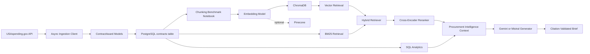

# GovIntel

Federal procurement intelligence platform for ingesting USAspending contract data,
storing structured awards in PostgreSQL, and evaluating retrieval strategies for
contract analysis.

GovIntel provides the data foundation for procurement market intelligence:
public contract awards are imported from USAspending.gov, normalized into typed
domain models, stored locally, and prepared for lexical, vector, and hybrid
retrieval workflows.

## Core Capabilities

- Async USAspending.gov contract award ingestion with pagination and rate-limit
  handling.
- PostgreSQL storage for normalized contract award records, including idempotent
  upserts.
- Local Docker Compose infrastructure for repeatable PostgreSQL setup.
- Typed Pydantic models for awards, analysis requests, contractor summaries,
  intelligence briefs, and search results.
- Text chunking strategies for fixed-window, sentence-based, and semantic
  segmentation.
- Sentence-transformers embedding support with ChromaDB indexing and optional
  Pinecone mirroring.
- BM25 keyword retrieval, vector retrieval, hybrid retrieval, and cross-encoder
  reranking components.
- SQL analytics for top contractors, quarterly spend trends, and market
  concentration.
- Versioned YAML prompt templates rendered with Jinja2.
- Gemini Flash and HuggingFace/Mistral generation clients behind a common async
  interface.
- Citation-grounded report generation that validates cited contract IDs against
  retrieved evidence before returning a brief.
- Offline evaluation harness with procurement-specific metrics, optional RAGAS
  scoring, annotated gold queries, and ablation-result table rendering.
- FastAPI service entry point with health checks, request validation, and
  `/api/v1/analyze` report generation.
- Notebook-based retrieval and chunking benchmark workflow backed by real
  PostgreSQL data.

## Architecture



## Tech Stack

- Python 3.10+
- FastAPI and Uvicorn
- PostgreSQL 16 with SQLAlchemy asyncio and asyncpg
- Pydantic v2 and pydantic-settings
- httpx for async API access
- sentence-transformers for embeddings and reranking
- ChromaDB for local vector search
- Pinecone support for managed vector search
- rank-bm25 for lexical retrieval
- Jinja2 and PyYAML for prompt template management
- RAGAS is available as an optional evaluation extra for offline eval work
- pytest and Ruff for automated quality checks

## Repository Layout

```text
src/govintel/
  api/          FastAPI application factory, routes, and dependencies
  ingestion/    USAspending client, PostgreSQL loader, embeddings, chunking
  retrieval/    BM25, vector search, hybrid retrieval, and reranking
  analysis/     SQL analytics for contractor rankings, trends, and HHI
  evaluation/   Custom metrics, optional RAGAS adapter, and ablation runner
  generation/   Prompt loading, LLM clients, report orchestration, citations
  models.py     Shared Pydantic domain models

eval/           Annotated evaluation queries and gold answers
notebooks/      Retrieval and chunking evaluation notebooks
prompts/        YAML prompt templates
tests/          Unit and integration-style test coverage
```

## Getting Started

### Prerequisites

- Python 3.10 or newer
- Docker and Docker Compose
- Network access to the public USAspending.gov API

The default local workflow uses public contract data and local infrastructure.
Optional external service keys can remain blank unless you are connecting a
managed vector store or downstream generation service.

### Install

```bash
git clone <repository-url>
cd GovtIntel
python3 -m venv .venv
source .venv/bin/activate
pip install -e ".[dev]"
```

### Configure

```bash
cp .env.example .env
```

The default `.env.example` is configured for the local PostgreSQL service in
`docker-compose.yml`. The ingestion defaults import a bounded slice of contract
awards for NAICS `541512`.

To use `/api/v1/analyze`, set `GENERATION_PROVIDER=gemini` with
`GEMINI_API_KEY`, or set `GENERATION_PROVIDER=mistral` with `HF_API_TOKEN`.
`HF_MODEL_ID` is optional and defaults to the fine-tuned GovIntel Mistral model
identifier used by the project plan.

### Start PostgreSQL

```bash
make db-up
```

### Import Contract Data

```bash
make db-seed
```

The seed command fetches contract awards from USAspending.gov and upserts them
into the `contracts` table.

You can override the import scope from the command line:

```bash
python3 -m govintel.ingestion.bootstrap \
  --naics-code 541512 \
  --max-pages 2 \
  --page-size 100
```

### Run the API

```bash
make run
```

The service starts on `http://localhost:8000`. Interactive OpenAPI
documentation is available at `http://localhost:8000/docs`, and the health check
is available at:

```bash
curl http://localhost:8000/api/v1/health
```

Generate a procurement intelligence brief after seeding contract data and
configuring a generation provider:

```bash
curl -X POST http://localhost:8000/api/v1/analyze \
  -H "Content-Type: application/json" \
  -d '{"question":"Who are the top DHS cybersecurity contractors?","agency_filter":"DHS"}'
```

### Run the Benchmark Notebook

Open `notebooks/02_chunking_benchmark.ipynb` in Jupyter or a compatible notebook
environment after seeding PostgreSQL. The notebook reads contract descriptions
from the `contracts` table and compares chunking strategies against retrieval
metrics.

## Quality Checks

```bash
pytest -q
pytest tests/test_evaluation -q
ruff check src/ tests/
```

The evaluation harness is designed to run in the base development environment.
RAGAS remains an optional offline dependency; install the eval extra before
running live RAGAS scoring:

```bash
pip install -e ".[dev,eval]"
```

## Data Model

The primary persisted table is `contracts`, keyed by `award_id`. Each row
captures the recipient, awarding agency, award amount, performance dates, NAICS
code, description, place of performance, and award type. Inserts use
`ON CONFLICT` upserts so repeated ingestion runs refresh existing records
without duplicating awards.

## License

MIT
